# 📄 Entregable #2 caso #1

## 1. Investigue como realizar un goal map en referencia a técnicas como google sprint o design thinking

Se utilizó este árticulo como referencia: https://www.uifrommars.com/que-es-design-sprint-fases/

* **Lunes:** Diseñar Goal Diagram y diagramarlo.

* **Martes:** Análisis del diagrama.

* **Miercoles:** Diseño de pantallas, diseño de wireframes.

* **Jueves:** Creacion de pantallas.

* **Viernes:** Test de usabilidad

## 2. Proceda a crear un goal diagram ubicando el objetivo principal del sistema lo más a la derecha del diagrama y las entidades involucradas a la izquierda. Rellene el workflow del mapa y diagramelo en alguna herramienta que se lo permita.

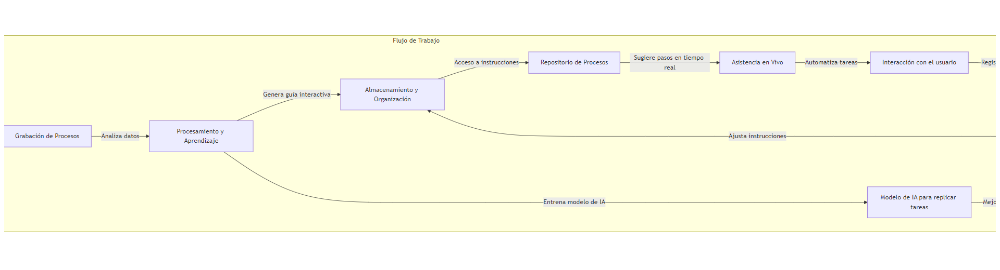
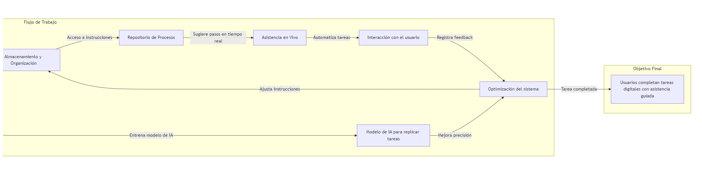
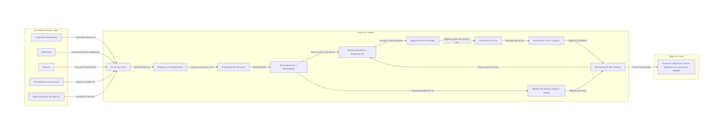

## 3. Determine entonces usando ese mapa cuales son los estados que garantizan el éxito del sistema, aquellos puntos que son más valiosos para lograr el objetivo principal del sistema, los cuales van a hacer que el usuario acepte o no el uso de esta aplicación.

### 1️⃣ Grabación de procesos precisa
- El sistema debe capturar acciones y comandos de voz eficientemente.  
- La grabación debe ser fluida.
- La grabacion en segundo plano debe ser sin interrupciones.  

### 2️⃣ Automatización de procesos
- Para usuarios avanzados, la app debe poder ejecutar tareas por sí misma.  
- La automatización debe ser segura y personalizable. 

### 3️⃣ Generación de guías utiles y fáciles de seguir
- Los usuarios deben recibir pasos claros a la hora de querer grabar una tarea.  

### 4️⃣ Asistencia en vivo en cualquier momento
- El usuario debe poder acceder a ayuda en tiempo real con facilidad.  
 
### 5️⃣ Optimización continua
- El sistema debe recibir feedback y mejorar sus respuestas con el tiempo.  
- Debe permitir ajustes manuales para corregir errores o personalizar tareas.  

## 4. Una vez determinados los más importantes, listelos y proceda a diseñar las pantallas de su sistema que realizarían dichos flujos del mapa.

## **1️⃣ Grabación de procesos precisa**  
✅ **Pantalla:** _Grabación de Tareas_   
- Botón de start/stop de grabación.  
- Indicador de estado de grabación.  
- Opción para capturar voz y acciones.  
- Vista previa de los pasos grabados.  

## **2️⃣ Automatización de procesos**  
✅ **Pantalla:** _Automatización de Tareas_   
- Lista de tareas automatizables.  
- Botón para ejecutar procesos automáticamente.  
- Opciones de personalización y seguridad.  

## **3️⃣ Generación de guías utiles y fáciles de seguir**  
✅ **Pantalla:** _Guía Interactiva_   
- Pasos con imagenes y texto.  
- Visualizaciones para cada acción.  
- Botón de "Reproducir guía". 

## **4️⃣ Asistencia en Vivo en cualquier momento**  
✅ **Pantalla:** _Asistencia en Tiempo Real_    
- Panel con la guía de tareas.  
- Opción para activar/desactivar la asistencia en vivo.

## **5️⃣ Optimización Continua**  
✅ **Pantalla:** _Feedback del Usuario_   
- Encuestas para cada tarea.  
- Campo para sugerencias de mejoras.  
- Historial de ajustes realizados por la IA.  

## 5. Diseñe los wireframes en blanco y negro de las pantallas necesarias para esos flujos prioridad #1 para el negocio.

### **Pantalla De Login:**

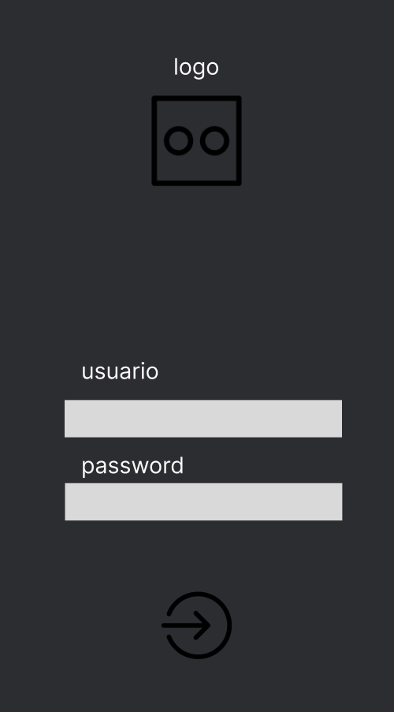

### **Pantalla De Menu Principal:**

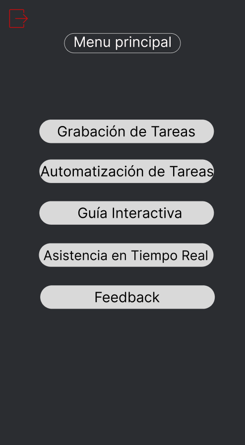

### **Pantalla De Grabacion De Tareas:**

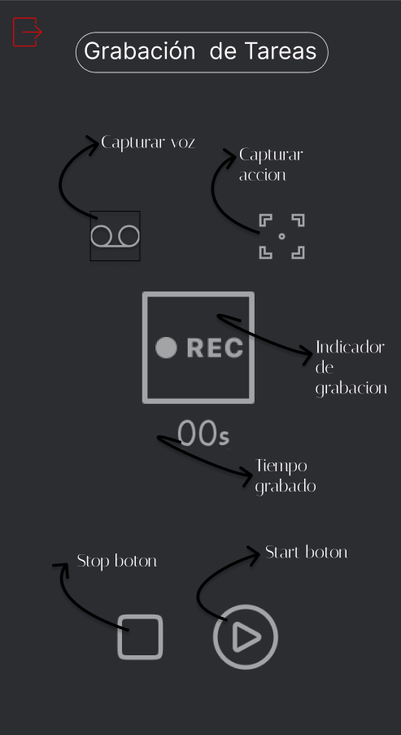

### **Pantalla De Automatizacion De Tareas:**

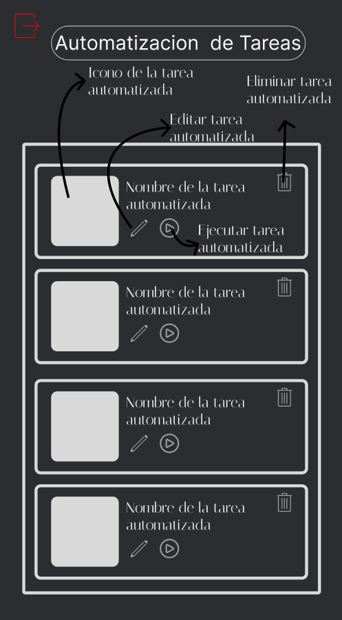

### **Pantalla De Guía Interactiva:**

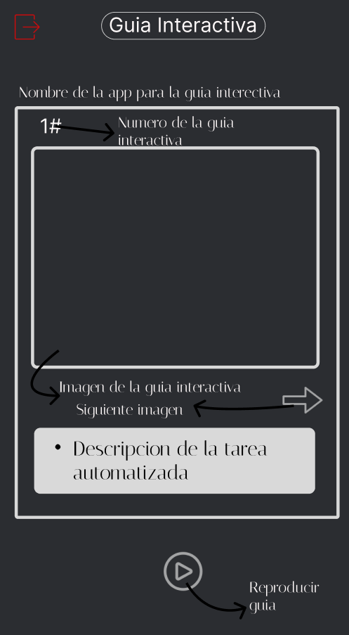

### **Pantalla De Asistencia En Tiempo Real:**

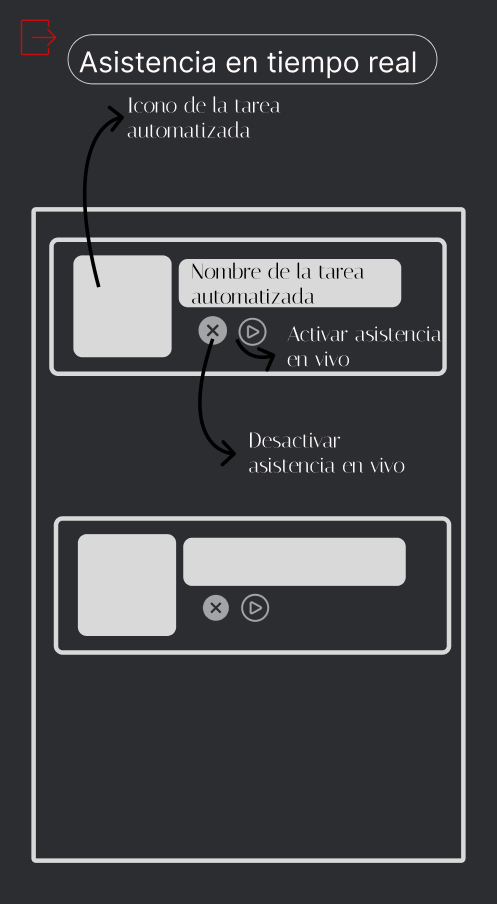

### **Pantalla De Feedback Del Usuario:**

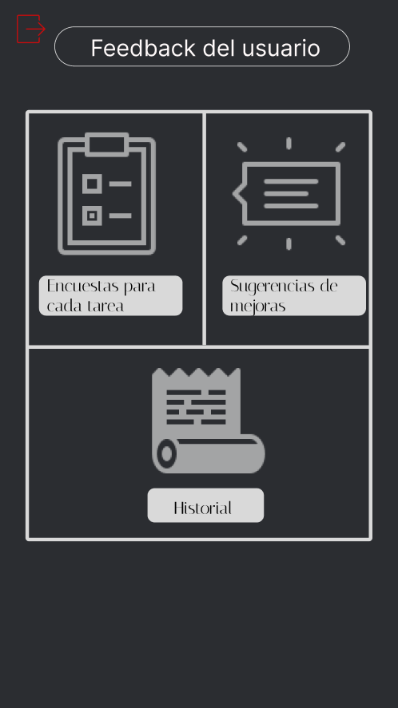

## 6. Cree las pantallas a modo mockup o mimic utilizando alguna AI que genere código en el lenguaje que haya seleccionado en el entregable #1. Si ninguna AI genera para ese lenguaje, entonces proceda a utilizar plantillas para crear las pantallas diseñadas.

### **URL Del Programa En Ejecucion**: https://preview--react-photo-mockup-genius.lovable.app/

### **Pantalla De Login:**

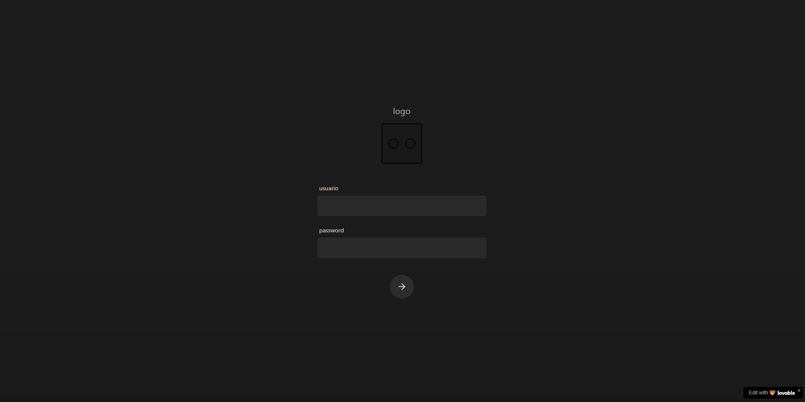

### **Pantalla De Menu Principal:**

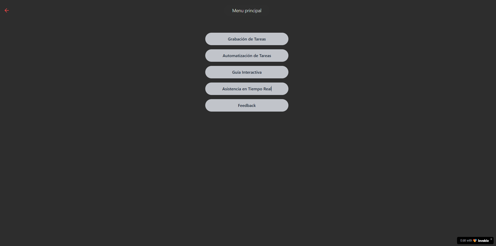

### **Pantalla De Grabacion De Tareas:**

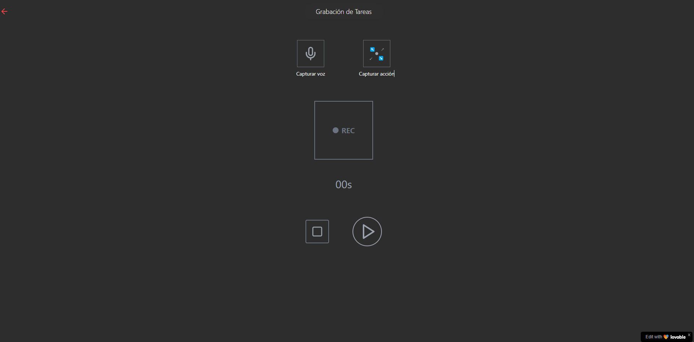

### **Pantalla De Automatizacion De Tareas:**

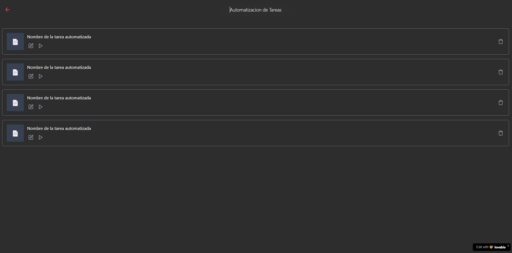

### **Pantalla De Guía Interactiva:**

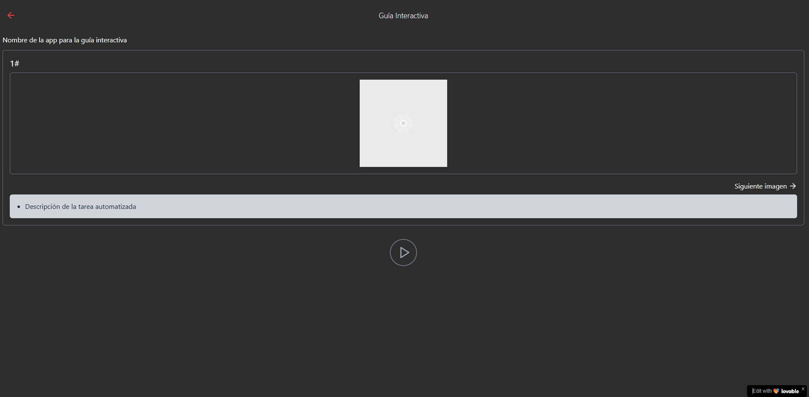

### **Pantalla De Asistencia En Tiempo Real:**

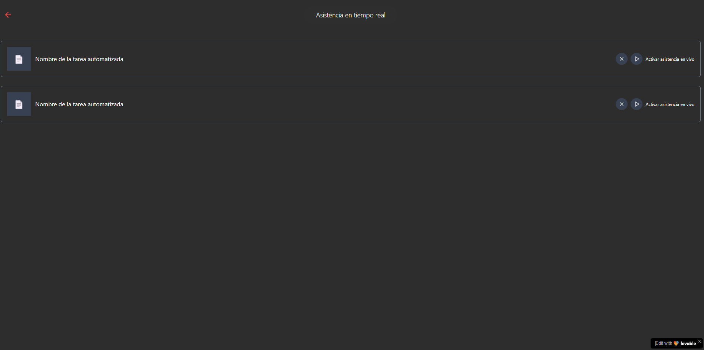

### **Pantalla De Feedback Del Usuario:**

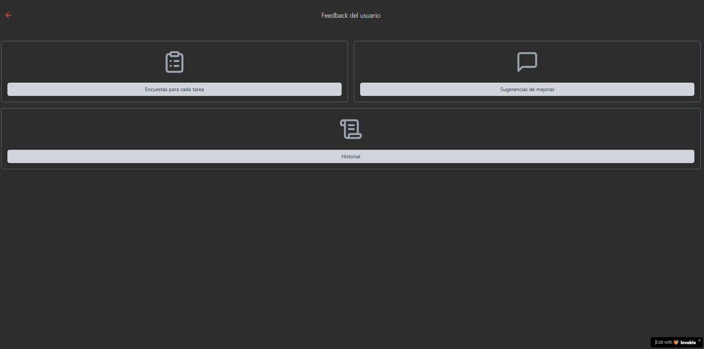

### **Pantalla De Feedback Del Usuario / Encuentas Para Tareas:**

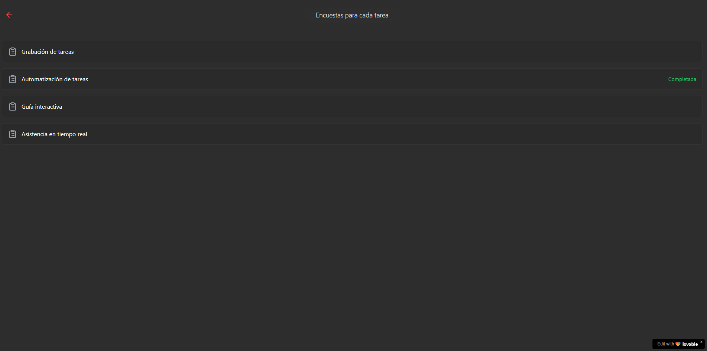

### **Pantalla De Feedback Del Usuario / Sugerencias De Mejoras:**

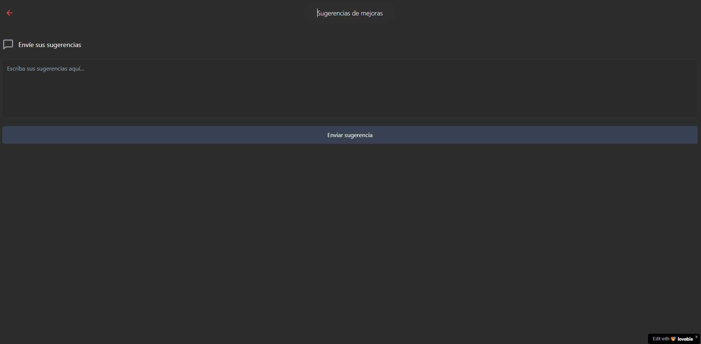

## 7. Proceda a realizar un test de usabilidad con al menos 3 personas (que no sean estudiantes del Tec), de las pantallas diseñadas utilizando alguna herramienta de testing de usuabilidad digital en la nube, recopile los resultados.

Se realizan 6 tareas en la pagina la cuales son:

- **1. Escribir un usuario y contraseña. Luego encontrar el boton de entrar.**
- **2. En el area de grabacion de tareas, seleccionar el boton de grabar la tarea.**
- **3. En automatizar de tareas, buscar el boton de editar la tarea automatizada.**
- **4. En la guia interactiva, buscar el boton  de pasar empezar la ejecucion.**
- **5. Activar boton de asistencia en vivo.**
- **6. Dejar una sugenrencia de mejora.**

Y estos son las pruebas de las tres personas, lo cual todas pasaron. Y tambien el mapa de calor del proyecto.

## **PRUEBAS**

### **Tareas Completadas**

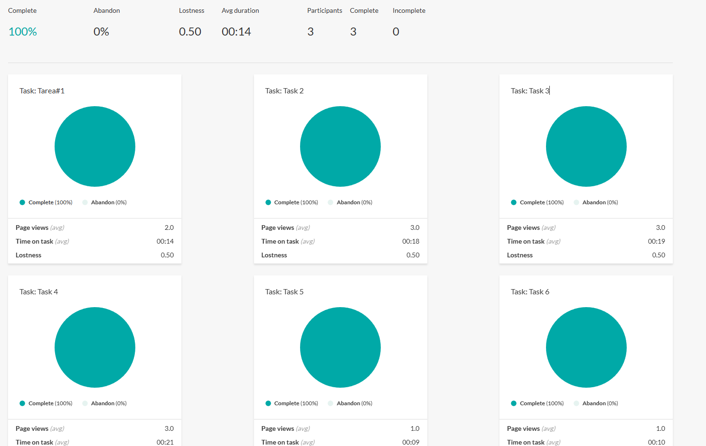

### **Mapas De Calor**

### 1️⃣

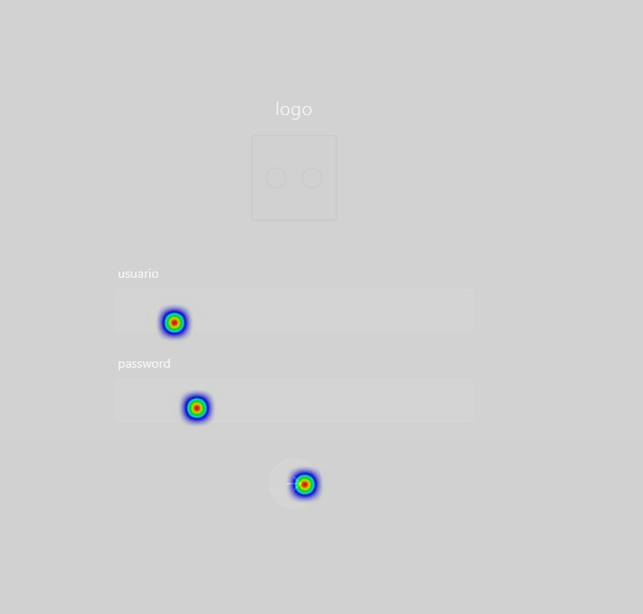

### 2️⃣

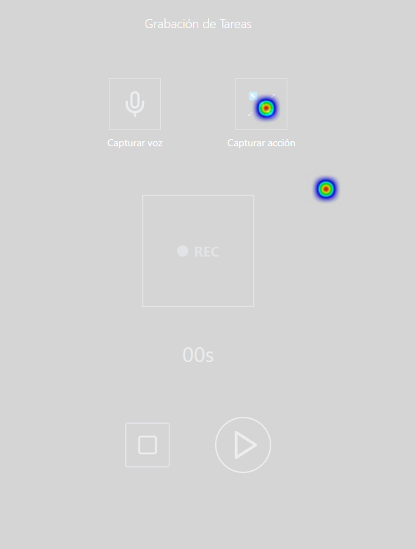

### 3️⃣

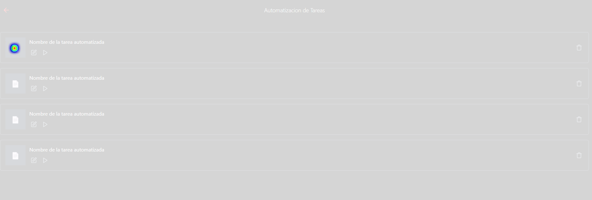

### 4️⃣

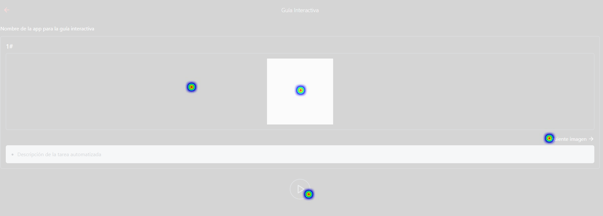

### 5️⃣

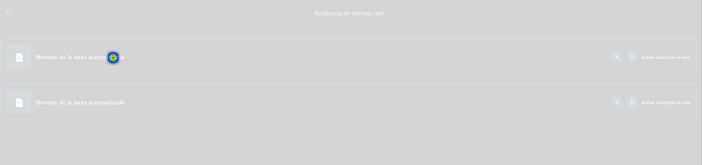

### 6️⃣

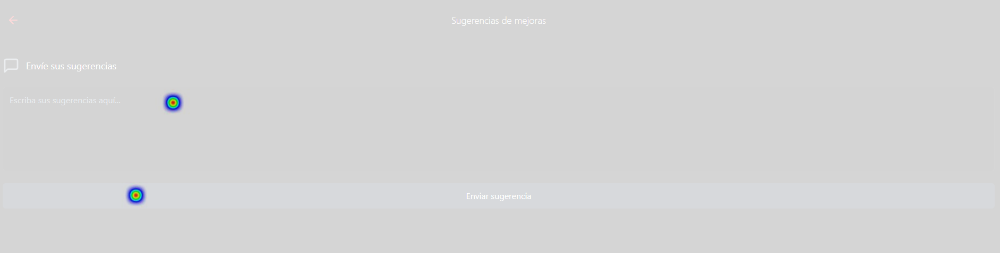

---
✍ **Autores:** Luis David Blanco Láscarez, Alex Brenes Garita

📅 **Fecha de entrega:** 09/03/25

🏫 **Institución:** Tecnológico de Costa Rica
